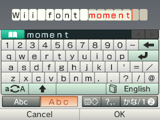
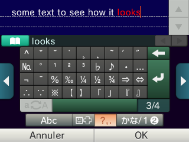
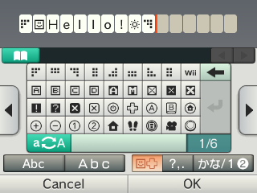
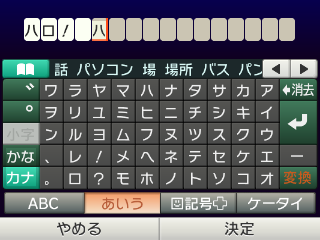
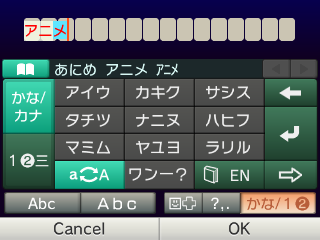

# 3DS custom keyboard

## Support
- Supported models: All
- Supported regions: EUR/USA/JPN
- Supported languages: All

## What's edited?
* Custom symbols
* Themes (Dark/Light)
* Replaced the phone keyboard with kanas (Japanese letters) keyboard
* Added a 5th button and arranged the layout for the fullwidth font (that looks like the Wii font) keyboard
  * Because of the way it works, this is not available on the Russian language, this keyboard is moved in the custom symbols section for this language
  * Thanks to [@ZeroSkill](https://github.com/ZeroSkill1) for patching the code for that

## Screenshots:










## WARNING: DO NOT uninstall your custom firmware.
* The keyboard is not signed, meaning it doesn't work without CFW.
* If you plan to uninstall CFW, then follow the [uninstallation tutorial](https://github.com/cooolgamer/3DS-custom-keyboard#how-to-uninstall).
* I am NOT responsible if you did, and have issues related to the keyboard, you have been warned.

## How to install?
### Getting the requirements
- Download the latest "Coool Custom Keyboard" archive in the [releases tab](https://github.com/cooolgamer/3DS-custom-keyboard/releases/)
- Extract the archive, put the "gm9" folder in the root of your sd card
- You should have the original, unmodified keyboard installed on your 3ds, if you have a custom one, you need to restore the original keyboard

### Preparing the patched keyboard
- Open godmode9 on your 3ds (hold start while booting) with your SD card in
- Press the home button, go to scripts, and then select the Custom Keyboard script
- Wait, **read** and accept the messages, which should reboot your 3ds if everything worked

### Install the custom keyboard
- Go to FBI, SD card, gm9, customkyb, select "Keyboard_Patched.cia" and "install CIA"
- Enjoy!

#

### Troubleshooting
Q: I'm getting "The keyboard is not legit. [...]" error,

A: Like the error says after, follow the uninstallation guide. You can also find and install the original keyboard cia on google, that works too.

If you ask why this is important, this is because the original, unmodified keyboard is required in order to patch it.

#
Q: I'm getting "Your keyboard does not match the expected one." error,

A: This happens if the dumped keyboard doesn't match the expected keyboard, as the keyboard should be legit, this can mean that either you're using a system firmware below 9.0, which is very old, or you selected the wrong region.
If this isn't the case, this shouldn't happen, try to contact me on github or discord.

#

Q: I'm getting "do you have the Patch[region].bps file?" error, but I'm sure that I have it,

A: Make sure you *actually* copied the files correctly (their file size shouldn't be 0 byte), or your sd card is probably dead and the files got corrupted, check your sd card for bad sectors.


## How to uninstall?
### First method: Using a Backup
- Go to FBI, SD card, gm9, customkyb, select "Keyboard_Original.cia" and "install CIA"
- Done!

### Second method: Using a System Update
If you don't have a backup, please follow these steps carefully:

- Go to fbi, select titles, wait for all titles to load, search for a red title named corresponding to your region:
  - ```000400300000D002``` on EUR
  - ```000400300000C802``` on USA
  - ```000400300000C002``` on JPN
- Select this title and choose "delete title and ticket", this will delete it but don't worry, we are going to reinstall it.
- Power off your console and launch recovery mode by holding ``L`` + ``R`` + ``A`` + ``dpad UP`` buttons and press power with all those buttons held.
- Once you get a menu telling you to perform a system update, press yes and accept everything.
- Wait for the update to complete and it's done!

### Third method: Using 3DNUS and Godmode9
If you're getting an error:

- Here, you have 2 choices, "KEYBOARD ONLY" and "ENTIRE FIRMWARE":
   - Keyboard only is just reinstalling the clean keyboard to fix the keyboard,
   - Entire firmware is reinstalling the entire clean firmware  which is strongly recommended if you plan removing CFW.
   - The steps not mentioning "KEYBOARD ONLY" or "ENTIRE FIRMWARE" are for both methods, follow them.

###
- Get [this version of 3DNUS](https://github.com/DrHacknik/3DNUS/releases/tag/3.3_stable) and download the corresponding version for your PC.
- Process to the setup: disable "enable auto update" and make sure "pack as cia" is enabled
- On "Title/Firmware", type the latest version and your region letter (ex: ```11.17.0-50E```) then press "Begin download" and wait.
- KEYBOARD ONLY: Put the following file corresponding to your region anywhere on your SD card:
  - ```000400300000D002.cia``` on EUR
  - ```000400300000C802.cia``` on USA
  - ```000400300000C002.cia``` on JPN
- ENTIRE FIRMWARE: Copy the folder containing all cias anywhere on your sd card.
- Open godmode9 on your console (hold start while booting and make sure it's updated up to v2.0.0 to support CIA installation).
- KEYBOARD ONLY: Navigate to SDCARD where you put the cia and select it.
- ENTIRE FIRMWARE: Navigate to SDCARD where you put the folder and select all cias inside with ``L`` + ``Dpad Right`` and select any of them.
- Choose ```CIA image options``` and ```Install game image``` then confirm.
- After waiting, press A, then start to reboot and it's done!
- You can now delete 3DNUS and the cia(s) you copied on your sd card.

## Need help or info?
You can contact me on my [Discord server](https://discord.gg/RxeZcgGRQB)

## Credits:
* [HMRT](https://github.com/schrmh/HMRT) (HomeMenu Rebuild Tool) which allowed me to easily extract and edit the cia
* [ctrtool, makerom](https://github.com/3DSGuy/Project_CTR/) and [3dstool](https://github.com/dnasdw/3dstool/) developers
* [@ZeroSkill](https://github.com/ZeroSkill1) for the russian Keyboard in all languages allowing more custom slots!
* Thanks to Zukkunda for inspiring me of the blue color (before v4)!
